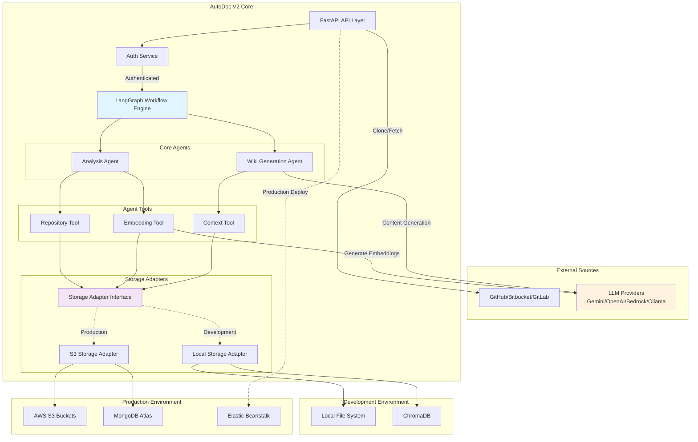
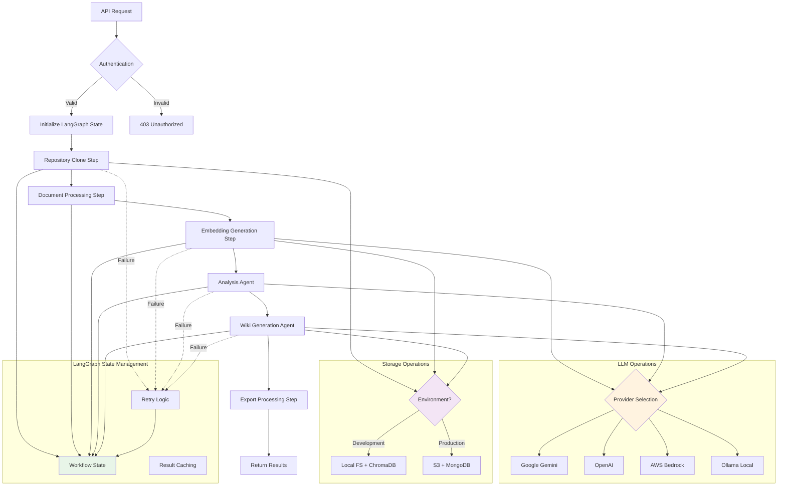

# AutoDoc V2 Refined Architecture Plan

This document outlines the refined architecture for AutoDoc V2, incorporating modern frameworks, cloud-native deployment strategies, and production-ready scalability improvements.

## Overview

AutoDoc V2 is a headless, API-first documentation generation system that processes Git repositories to create comprehensive technical documentation through AI-powered analysis. The system leverages LangGraph for workflow orchestration, environment-adaptive storage, and provider-agnostic LLM integration.

## Key Architectural Changes from V1

- **Framework Migration**: Custom processing → LangGraph workflow orchestration + LangChain components
- **Storage Strategy**: Environment-adaptive (Local/ChromaDB for dev, S3/MongoDB for production)
- **Provider Agnostic**: JSON-configured multi-provider LLM support
- **Cloud Native**: AWS-first production deployment with Elastic Beanstalk
- **Headless Design**: Pure API service without frontend components

## Technology Stack

### Core Framework
- **FastAPI** server for high-performance API endpoints
- **LangGraph** for stateful workflow orchestration and complex processing pipelines
- **LangChain** for document loading, text splitting, and tokenization

### Storage & Data Management
- **Development**: Local file system + **ChromaDB** for vector storage
- **Production**: **AWS S3** for repository storage + **MongoDB** for scalable persistence
- **Vector Operations**: ChromaDB (dev) / MongoDB vector search (production)

### LLM & AI Integration
- **Provider Agnostic**: Google Gemini, OpenAI, AWS Bedrock
- **Configuration**: JSON-based provider management
- **Embeddings**: OpenAI embeddings or compatible alternatives
- **RAG**: Context-aware retrieval with environment-specific vector stores

### Cloud & Deployment
- **AWS S3**: Repository storage and file system access
- **AWS Elastic Beanstalk**: Application deployment and scaling
- **AWS IAM**: Role-based authentication for enterprise deployments
- **boto3**: AWS services integration

## High-Level Architecture



## Detailed Workflow Architecture



## Project Structure

```
src/
├── agents/                     # LangGraph workflow agents
│   ├── __init__.py
│   ├── analysis_agent.py       # Code analysis and structure detection
│   └── wiki_agent.py          # Wiki content generation
├── models/                     # Pydantic data models
│   ├── __init__.py
│   ├── repository.py          # Repository metadata models
│   ├── wiki.py               # Wiki structure models
│   ├── config.py             # Configuration models
│   └── responses.py          # API response models
├── prompts/                   # LLM prompt templates
│   ├── __init__.py
│   ├── analysis_prompts.py   # Code analysis prompts
│   ├── wiki_prompts.py       # Wiki generation prompts
│   └── structure_prompts.py  # Structure detection prompts
├── tools/                     # Agent tools (LangGraph tools)
│   ├── __init__.py
│   ├── repository_tool.py    # Repository management tool
│   ├── embedding_tool.py     # Vector embedding operations tool
│   ├── context_tool.py       # RAG context retrieval tool
│   └── llm_tool.py           # LLM provider management tool
├── services/                  # Core services
│   ├── __init__.py
│   └── auth_service.py       # Authentication and authorization
├── utils/                     # Utility functions
│   ├── __init__.py
│   ├── storage_adapters.py   # Environment-specific storage
│   ├── config_loader.py      # Configuration management
│   ├── logging_config.py     # Structured logging
│   └── retry_utils.py        # Backoff and retry logic
└── api/                       # FastAPI application
    ├── __init__.py
    ├── main.py               # Application entry point
    ├── routes/               # API route definitions
    │   ├── __init__.py
    │   ├── wiki.py          # Wiki generation endpoints
    │   └── health.py        # Health check endpoints
    └── middleware/           # Custom middleware
        ├── __init__.py
        ├── auth.py          # Authentication middleware
        └── logging.py       # Request logging middleware

tests/                        # Test suite
├── unit/                     # Unit tests
├── integration/              # Integration tests
└── fixtures/                 # Test data and fixtures
```

## Core Components

### 1. LangGraph Workflow Engine

**Purpose**: Orchestrates complex, stateful processing workflows with automatic retry and error handling.

**Key Features**:
- Stateful workflow execution with checkpoint persistence
- Automatic retry logic for transient failures
- Parallel processing capabilities for independent tasks
- Workflow visualization and debugging support

### 2. Storage Adapter Pattern

**Purpose**: Environment-agnostic storage abstraction for seamless dev/prod transitions.

**Implementation**:
```python
class StorageAdapter(ABC):
    @abstractmethod
    async def store_repository(self, repo_data: bytes) -> str
    
    @abstractmethod
    async def retrieve_embeddings(self, repo_id: str) -> List[Embedding]
    
    @abstractmethod
    async def cache_wiki(self, wiki_data: WikiStructure) -> str

class LocalStorageAdapter(StorageAdapter):
    # ChromaDB + Local FS implementation
    
class S3StorageAdapter(StorageAdapter):
    # MongoDB + S3 implementation
```

### 3. Agent Tools (LangGraph Tools)

**Purpose**: Provide specific capabilities that agents can invoke during workflow execution.

**Tool Examples**:
```python
from langchain.tools import BaseTool
from typing import Type
from pydantic import BaseModel, Field

class RepositoryToolInput(BaseModel):
    repository_url: str = Field(description="Git repository URL to clone")
    branch: str = Field(default="main", description="Branch to checkout")

class RepositoryTool(BaseTool):
    name = "repository_tool"
    description = "Clone and process Git repositories"
    args_schema: Type[BaseModel] = RepositoryToolInput
    
    def _run(self, repository_url: str, branch: str = "main") -> str:
        # Repository cloning implementation
        pass

class EmbeddingTool(BaseTool):
    name = "embedding_tool"
    description = "Generate embeddings for code documents"
    
    def _run(self, documents: List[str]) -> List[Embedding]:
        # Embedding generation implementation
        pass
```

### 4. LLM Provider Management

**Purpose**: JSON-configured, provider-agnostic LLM integration.

**Configuration Example**:
```json
{
  "providers": {
    "openai": {
      "api_key": "${OPENAI_API_KEY}",
      "models": ["gpt-4", "gpt-3.5-turbo"],
      "default_model": "gpt-4"
    },
    "gemini": {
      "api_key": "${GEMINI_API_KEY}",
      "models": ["gemini-pro", "gemini-pro-vision"],
      "default_model": "gemini-pro"
    }
  },
  "default_provider": "openai"
}
```

### 5. Environment-Aware Configuration

**Development Configuration**:
```yaml
environment: development
storage:
  type: local
  vector_store: chromadb
  repository_path: ./repositories
llm:
  provider: ollama
  model: llama2
```

**Production Configuration**:
```yaml
environment: production
storage:
  type: s3
  bucket: autodoc-repositories
  vector_store: mongodb
  connection_string: ${MONGODB_URI}
llm:
  provider: openai
  model: gpt-4
aws:
  region: us-west-2
  role_arn: ${AWS_ROLE_ARN}
```

## API Endpoints

### Repository Processing
```
POST /api/v2/repositories/process
{
  "repository_url": "https://github.com/owner/repo",
  "branch": "main",
  "access_token": "optional_token",
  "options": {
    "include_patterns": ["*.py", "*.md"],
    "exclude_patterns": ["**/tests/**"],
    "llm_provider": "openai",
    "output_format": ["markdown", "json"]
  }
}
```

### Wiki Generation
```
POST /api/v2/wikis/generate
{
  "repository_id": "repo_uuid",
  "structure_prompt": "optional_custom_prompt",
  "sections": ["architecture", "api", "deployment"]
}
```

### Export Operations
```
GET /api/v2/wikis/{wiki_id}/export?format=markdown
GET /api/v2/wikis/{wiki_id}/export?format=json
```

## Deployment Strategies

### Development Environment
- **Local FastAPI** server with auto-reload
- **ChromaDB** for vector storage (SQLite backend)
- **Local file system** for repository storage
- **Ollama** for local LLM inference

### Production Environment
- **AWS Elastic Beanstalk** for application hosting
- **MongoDB Atlas** for vector operations and metadata
- **AWS S3** for repository and artifact storage
- **Multi-provider LLM** support with fallback chains

## Security & Authentication

### Private Repository Access
- **Personal Access Tokens** for GitHub/GitLab/Bitbucket
- **SSH Key Management** for enterprise Git servers
- **Token encryption** at rest and in transit

### AWS Integration
- **IAM Role-based** authentication for S3 access
- **VPC Security Groups** for network isolation
- **CloudTrail** logging for audit compliance

## Monitoring & Observability

### Structured Logging
- **JSON-formatted** logs with correlation IDs
- **LangGraph execution** tracing and metrics
- **Performance monitoring** for LLM calls and storage operations

### Health Checks
- **Readiness probes** for storage connections
- **Liveness checks** for LLM provider availability
- **Dependency health** monitoring (S3, MongoDB, LLM APIs)

## Scalability Considerations

### Horizontal Scaling
- **Stateless FastAPI** instances behind load balancer
- **MongoDB sharding** for large-scale vector operations
- **S3 distributed storage** with multi-region replication

### Performance Optimization
- **Embedding caching** to avoid recomputation
- **Parallel processing** of repository files
- **Streaming responses** for large wiki generation
- **Connection pooling** for database operations

## Migration Path from V1

### Phase 1: Core Infrastructure
1. Set up LangGraph workflow engine
2. Implement storage adapter pattern
3. Create provider-agnostic LLM service

### Phase 2: Feature Parity
1. Migrate webhook processing to LangGraph agents
2. Replace custom RAG with LangChain + ChromaDB/MongoDB
3. Implement new API endpoints

### Phase 3: Enhanced Features
1. Add multi-provider LLM support
2. Implement production-ready monitoring
3. Add horizontal scaling capabilities

### Phase 4: Production Deployment
1. AWS Elastic Beanstalk deployment
2. MongoDB Atlas integration
3. S3 repository storage migration

## Success Metrics

### Performance Targets
- **API Response Time**: < 200ms for status endpoints
- **Wiki Generation**: < 5 minutes for medium repositories
- **Embedding Generation**: < 30 seconds per 1MB of code
- **Storage Operations**: < 100ms for metadata queries

### Reliability Goals
- **Uptime**: 99.9% availability
- **Error Rate**: < 0.1% for successful operations
- **Recovery Time**: < 5 minutes for transient failures
- **Data Durability**: 99.999% for stored artifacts

---

This V2 architecture provides a solid foundation for scalable, production-ready documentation generation with modern frameworks and cloud-native deployment strategies.
