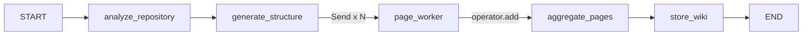

# Parallel Page Generation Implementation Plan

> **For Claude:** REQUIRED SUB-SKILL: Use superpowers:executing-plans to implement this plan task-by-task.

**Goal:** Replace the current non-functional sequential `_generate_pages_node` with a parallel implementation using LangGraph's Send API, where page workers read files from disk using the existing `file_paths` from wiki structure.

**Architecture:** The Deep Agent outputs wiki structure with `file_paths` per page (current behavior - unchanged). The `generate_pages` phase fans out to parallel page workers via LangGraph Send. Each worker reads files from disk using `clone_path` + `file_paths`, generates content, and returns results. LangGraph automatically aggregates results via the `operator.add` reducer.

**Tech Stack:** LangGraph (Send API, StateGraph, Annotated reducers), langchain-openai (ChatOpenAI), Python pathlib/os for file reading

---

## Current State (from LangSmith Trace 019b76e2-be5c-72a0-b70a-d5f121837e78)

| Component | Status |
|-----------|--------|
| `_generate_structure_node` | Working - produces 11 pages with `file_paths` |
| `finalize_wiki_structure` output | Contains `file_paths` per page (e.g., `["app.py", "config.py"]`) |
| `_generate_pages_node` | **NOT WORKING** - executes in 0.00s, outputs `generated_pages: []` |
| `clone_path` in state | **MISSING** - needs to be added |

## Key Constraint

**DO NOT modify the Deep Agent prompt or `WikiPageInput` schema.**
The existing output with `file_paths` is sufficient. Page workers will read files from disk.

---

## IMPORTANT: LangGraph Send Patterns (from official documentation)

### Pattern 1: Worker State Must Share Aggregation Key with Main State

```python
# Main graph state
class State(TypedDict):
    completed_sections: Annotated[list, operator.add]  # Shared aggregation key

# Worker state - MUST include the same key with same reducer!
class WorkerState(TypedDict):
    section: Section
    completed_sections: Annotated[list, operator.add]  # SAME key, SAME reducer
```

### Pattern 2: Send Payload Becomes Worker Input

```python
def fan_out(state: State):
    return [Send("worker", {"section": s, "completed_sections": []}) for s in state["sections"]]

def worker(state: WorkerState):  # Receives Send payload as state
    return {"completed_sections": [result]}  # Writes to shared key
```

---

## Phase 1: State Updates

### Task 1: Add `clone_path` to `WikiGenerationState`

**Files:**
- Modify: `src/agents/wiki_agent.py:29-42`

**Step 1: Read current state definition**

Read `WikiGenerationState` to confirm current fields.

**Step 2: Add clone_path field**

Modify `WikiGenerationState` in `src/agents/wiki_agent.py`:

```python
class WikiGenerationState(TypedDict):
    """State for wiki generation workflow"""

    repository_id: str
    file_tree: str
    readme_content: str
    wiki_structure: Optional[Dict[str, Any]]
    # CRITICAL: Use Annotated with operator.add for parallel worker result aggregation
    generated_pages: Annotated[List[Dict[str, Any]], operator.add]
    current_page: Optional[str]
    current_step: str
    error_message: Optional[str]
    progress: float
    start_time: str
    messages: List[BaseMessage]
    clone_path: Optional[str]  # Path to cloned repository for file access
```

**Step 3: Update imports at top of file**

```python
from typing import Annotated, Any, Dict, List, Optional
import operator
```

**Step 4: Run type check**

Run: `python -m mypy src/agents/wiki_agent.py --ignore-missing-imports`
Expected: No errors related to WikiGenerationState

**Step 5: Commit**

```bash
git add src/agents/wiki_agent.py
git commit -m "feat(state): add clone_path and Annotated generated_pages to WikiGenerationState"
```

---

### Task 2: Create `PageWorkerState` TypedDict

**Files:**
- Modify: `src/agents/wiki_agent.py` (add after WikiGenerationState)

**Step 1: Add PageWorkerState definition**

Add after `WikiGenerationState`:

```python
class PageWorkerState(TypedDict):
    """State for individual page generation worker.

    CRITICAL: This state MUST include `generated_pages` with the SAME
    Annotated reducer as WikiGenerationState. This is required for
    LangGraph to properly aggregate results from parallel workers.

    The worker receives this state via Send() and writes its result
    to generated_pages, which gets merged into the main state.
    """
    page_info: Dict[str, Any]  # Page definition from wiki_structure
    clone_path: Optional[str]  # For reading files from disk
    # MUST match WikiGenerationState for aggregation!
    generated_pages: Annotated[List[Dict[str, Any]], operator.add]
```

**Step 2: Commit**

```bash
git add src/agents/wiki_agent.py
git commit -m "feat(state): add PageWorkerState with shared generated_pages reducer"
```

---

### Task 3: Update `_generate_structure_node` to Set `clone_path` in State

**Files:**
- Modify: `src/agents/wiki_agent.py:346-422`

**Step 1: Read current implementation**

Read the `_generate_structure_node` method to find where `clone_path` is validated.

**Step 2: Add clone_path to returned state**

Find the section after `clone_path = Path(repository.clone_path)` validation (around line 376) and add:

```python
            clone_path = Path(repository.clone_path)
            if not clone_path.exists():
                state["error_message"] = f"Clone path does not exist: {clone_path}"
                return state

            # IMPORTANT: Set clone_path in state for page workers to access files
            state["clone_path"] = str(clone_path)

            owner = repository.org or "unknown"
```

**Step 3: Run tests**

Run: `pytest tests/unit/test_wiki_agent.py -v --tb=short`

**Step 4: Commit**

```bash
git add src/agents/wiki_agent.py
git commit -m "feat(workflow): set clone_path in state during structure generation"
```

---

## Phase 2: Parallel Page Generation Functions

### Task 4: Implement `fan_out_to_page_workers` Function

**Files:**
- Modify: `src/agents/wiki_agent.py` (add new function before WikiGenerationAgent class)

**Step 1: Add import for Send**

Add to imports at top of file:

```python
from langgraph.types import Send
```

**Step 2: Add fan_out_to_page_workers function**

Add before `WikiGenerationAgent` class:

```python
def fan_out_to_page_workers(state: WikiGenerationState) -> list[Send]:
    """Create parallel page generation tasks using LangGraph Send.

    Each Send creates a separate page_worker execution with its own state.
    The worker state includes `generated_pages` with the same reducer as
    the main state, allowing LangGraph to aggregate results automatically.

    Args:
        state: Current workflow state with wiki_structure and clone_path

    Returns:
        List of Send objects, one per page to generate
    """
    if not state.get("wiki_structure"):
        logger.warning("No wiki_structure found, cannot fan out to page workers")
        return []

    pages = state["wiki_structure"].get("pages", [])
    if not pages:
        logger.warning("No pages in wiki_structure")
        return []

    clone_path = state.get("clone_path")
    if not clone_path:
        logger.error("clone_path not set in state, cannot read files for page generation")
        return []

    sends = []
    for page in pages:
        # Each Send payload becomes the worker's input state
        # CRITICAL: Must include generated_pages for aggregation to work
        sends.append(
            Send("page_worker", {
                "page_info": page,
                "clone_path": clone_path,
                "generated_pages": [],  # Will be populated by worker, then aggregated
            })
        )

    logger.info(f"Fanning out to {len(sends)} parallel page workers")
    return sends
```

**Step 3: Commit**

```bash
git add src/agents/wiki_agent.py
git commit -m "feat(workflow): implement fan_out_to_page_workers with LangGraph Send"
```

---

### Task 5: Implement `page_worker_node` Async Function

**Files:**
- Modify: `src/agents/wiki_agent.py` (add new async function)

**Step 1: Add page_worker_node function**

Add after `fan_out_to_page_workers`:

```python
async def page_worker_node(state: PageWorkerState) -> Dict[str, Any]:
    """Generate content for a single wiki page by reading files from disk.

    This node runs in parallel for each page via LangGraph's Send API.
    It reads files using clone_path + file_paths, then generates content.

    IMPORTANT: Returns {"generated_pages": [page_result]} which gets
    aggregated with other workers via the operator.add reducer.

    Args:
        state: PageWorkerState with page_info, clone_path, and generated_pages

    Returns:
        Dict with 'generated_pages' list containing the page with generated content
    """
    import os
    from langchain_openai import ChatOpenAI
    from langchain_core.messages import HumanMessage

    page_info = state["page_info"]
    clone_path = state.get("clone_path")
    file_paths = page_info.get("file_paths", [])

    logger.info(f"Page worker starting: {page_info['title']} with {len(file_paths)} files")

    # Read file contents from disk
    file_contents: Dict[str, str] = {}

    if clone_path and file_paths:
        for file_path in file_paths[:10]:  # Limit to 10 files per page
            full_path = os.path.join(clone_path, file_path)
            try:
                if os.path.exists(full_path) and os.path.isfile(full_path):
                    with open(full_path, "r", encoding="utf-8", errors="ignore") as f:
                        content = f.read()
                        # Limit file size to prevent token overflow
                        file_contents[file_path] = content[:15000]
                        logger.debug(f"Read file: {file_path} ({len(content)} chars)")
                else:
                    logger.warning(f"File not found or not a file: {full_path}")
            except Exception as e:
                logger.warning(f"Failed to read file {file_path}: {e}")

    if not file_contents:
        logger.warning(f"No file contents available for page: {page_info['title']}")
        # Return page without content - will be skipped or show placeholder
        return {"generated_pages": []}

    # Build prompt with file contents
    files_markdown = "\n\n".join([
        f"### File: {path}\n```\n{content[:8000]}\n```"
        for path, content in file_contents.items()
    ])

    prompt = f"""Generate comprehensive wiki documentation for this page.

## Page Information
- **Title:** {page_info['title']}
- **Section:** {page_info['section']}
- **Description:** {page_info['description']}

## Source Files
{files_markdown}

## Requirements
1. Write clear, professional technical documentation in Markdown
2. Include code examples extracted from the source files
3. Explain the purpose and usage of each component
4. Use proper headings, lists, and code blocks
5. Be comprehensive but concise
6. Do NOT include a title heading (it will be added automatically)

Generate the page content now:
"""

    try:
        llm = ChatOpenAI(model="gpt-4o-mini", temperature=0)
        response = await llm.ainvoke([HumanMessage(content=prompt)])

        # Build result page
        page_result = {
            "title": page_info["title"],
            "slug": page_info["slug"],
            "section": page_info["section"],
            "description": page_info["description"],
            "file_paths": page_info.get("file_paths", []),
            "content": response.content,
        }

        logger.info(f"Generated content for page: {page_info['title']} ({len(response.content)} chars)")

        # Return in format for aggregation via operator.add
        return {"generated_pages": [page_result]}

    except Exception as e:
        logger.error(f"Failed to generate page {page_info['title']}: {e}")
        return {"generated_pages": []}
```

**Step 2: Commit**

```bash
git add src/agents/wiki_agent.py
git commit -m "feat(workflow): implement page_worker_node that reads files from disk"
```

---

### Task 6: Implement `aggregate_pages_node` Function

**Files:**
- Modify: `src/agents/wiki_agent.py` (add new function)

**Step 1: Add aggregate_pages_node function**

Add after `page_worker_node`:

```python
async def aggregate_pages_node(state: WikiGenerationState) -> Dict[str, Any]:
    """Aggregate results from all parallel page workers.

    NOTE: LangGraph automatically aggregates generated_pages from all workers
    via the operator.add reducer BEFORE this node runs. This node receives
    the already-merged results.

    This node:
    1. Logs the aggregation results
    2. Updates progress and step status
    3. Prepares state for the store_wiki node

    Args:
        state: WikiGenerationState with aggregated generated_pages

    Returns:
        Updated state dict with progress and step updates
    """
    generated_pages = state.get("generated_pages", [])

    logger.info(f"Aggregated {len(generated_pages)} generated pages from parallel workers")

    return {
        "current_step": "pages_generated",
        "progress": 90.0,
    }
```

**Step 2: Commit**

```bash
git add src/agents/wiki_agent.py
git commit -m "feat(workflow): implement aggregate_pages_node for post-worker status update"
```

---

## Phase 3: Workflow Update

### Task 7: Update `_create_workflow` to Use Send Pattern

**Files:**
- Modify: `src/agents/wiki_agent.py:75-105` (_create_workflow method)

**Step 1: Read current workflow**

Read the `_create_workflow` method to understand current structure.

**Step 2: Replace _create_workflow method**

Replace the entire `_create_workflow` method:

```python
def _create_workflow(self) -> StateGraph:
    """Create the wiki generation workflow graph with parallel page generation.

    Workflow:
        START -> analyze_repository -> generate_structure
              -> [parallel page_workers via Send] -> aggregate_pages
              -> store_wiki -> END

    The Send API creates parallel page_worker executions, each processing
    one page. Results are automatically aggregated via the operator.add
    reducer on generated_pages.

    Returns:
        Compiled LangGraph StateGraph
    """
    from langgraph.graph import END, START

    # Create workflow graph
    workflow = StateGraph(WikiGenerationState)

    # Add nodes
    workflow.add_node("analyze_repository", self._analyze_repository_node)
    workflow.add_node("generate_structure", self._generate_structure_node)
    workflow.add_node("page_worker", page_worker_node)  # Parallel page generator
    workflow.add_node("aggregate_pages", aggregate_pages_node)  # Post-aggregation status
    workflow.add_node("store_wiki", self._store_wiki_node)
    workflow.add_node("handle_error", self._handle_error_node)

    # Define workflow edges
    workflow.add_edge(START, "analyze_repository")
    workflow.add_edge("analyze_repository", "generate_structure")

    # Fan-out: generate_structure -> parallel page_workers via Send
    # Each Send creates a separate page_worker execution
    workflow.add_conditional_edges(
        "generate_structure",
        fan_out_to_page_workers,
        ["page_worker"]
    )

    # Fan-in: all page_workers -> aggregate_pages
    # LangGraph aggregates generated_pages via operator.add before this node
    workflow.add_edge("page_worker", "aggregate_pages")

    # Continue to storage
    workflow.add_edge("aggregate_pages", "store_wiki")
    workflow.add_edge("store_wiki", END)

    # Error handling
    workflow.add_edge("handle_error", END)

    app = workflow.compile().with_config({"run_name": "wiki_agent.wiki_generation_workflow"})
    logger.debug(f"Wiki generation workflow (parallel):\n{app.get_graph().draw_mermaid()}")
    return app
```

**Step 3: Run tests**

Run: `pytest tests/unit/test_wiki_agent.py -v --tb=short`

**Step 4: Commit**

```bash
git add src/agents/wiki_agent.py
git commit -m "feat(workflow): update _create_workflow to use LangGraph Send pattern"
```

---

## Phase 4: Store Node Update

### Task 8: Update `_store_wiki_node` to Use Aggregated `generated_pages`

**Files:**
- Modify: `src/agents/wiki_agent.py` (_store_wiki_node method)

**Step 1: Read current store_wiki_node**

Read the `_store_wiki_node` method to understand current implementation.

**Step 2: Update to use generated_pages**

Ensure the method uses `state.get("generated_pages", [])` instead of original pages:

```python
async def _store_wiki_node(
    self, state: WikiGenerationState
) -> WikiGenerationState:
    """Store generated wiki structure to database.

    Uses `generated_pages` from parallel workers (aggregated by LangGraph)
    rather than the original pages from wiki_structure.
    """
    try:
        state["current_step"] = "storing_wiki"

        if not state.get("wiki_structure"):
            state["error_message"] = "No wiki structure to store"
            return state

        # IMPORTANT: Use generated_pages from parallel workers, not original pages
        pages_to_store = state.get("generated_pages", [])

        if not pages_to_store:
            # Fallback to original pages if parallel generation failed
            pages_to_store = state["wiki_structure"].get("pages", [])
            logger.warning("No generated pages found, falling back to original structure")

        # ... rest of existing implementation, but use pages_to_store ...
```

**Step 3: Run tests**

Run: `pytest tests/ -v --tb=short`

**Step 4: Commit**

```bash
git add src/agents/wiki_agent.py
git commit -m "feat(workflow): update _store_wiki_node to use aggregated generated_pages"
```

---

## Phase 5: State Initialization and Cleanup

### Task 9: Update `generate_wiki` to Initialize All State Fields

**Files:**
- Modify: `src/agents/wiki_agent.py` (generate_wiki method)

**Step 1: Read current generate_wiki**

Read the `generate_wiki` method to find initial state setup.

**Step 2: Ensure all fields initialized**

Update initial state creation:

```python
initial_state: WikiGenerationState = {
    "repository_id": repository_id,
    "file_tree": "",
    "readme_content": "",
    "wiki_structure": None,
    "generated_pages": [],  # CRITICAL: Initialize for parallel aggregation
    "current_page": None,
    "current_step": "starting",
    "error_message": None,
    "progress": 0.0,
    "start_time": datetime.utcnow().isoformat(),
    "messages": [],
    "clone_path": None,  # Will be set by _generate_structure_node
}
```

**Step 3: Commit**

```bash
git add src/agents/wiki_agent.py
git commit -m "feat(workflow): ensure generate_wiki initializes all state fields"
```

---

### Task 10: Remove Old `_generate_pages_node` Method

**Files:**
- Modify: `src/agents/wiki_agent.py`

**Step 1: Locate and remove the old method**

Find `_generate_pages_node` (lines 424-477) and delete it entirely.

Also remove `_generate_page_content`, `_get_relevant_source_files`, and `_find_additional_relevant_files` if they are no longer used.

**Step 2: Run all tests**

Run: `pytest tests/ -v --tb=short`
Fix any failing tests.

**Step 3: Commit**

```bash
git add src/agents/wiki_agent.py
git commit -m "refactor(workflow): remove deprecated sequential page generation methods"
```

---

## Phase 6: Integration Testing

### Task 11: Run Full Test Suite and Fix Issues

**Step 1: Run all tests**

```bash
pytest tests/ -v --tb=short
```

**Step 2: Fix any failing tests**

Update tests that depend on old method signatures or behavior.

**Step 3: Commit fixes**

```bash
git add -A
git commit -m "test: fix tests for parallel page generation workflow"
```

---

### Task 12: Manual E2E Test

**Step 1: Start dev server**

```powershell
.\scripts\dev-run.ps1
```

**Step 2: Trigger wiki generation via API**

Use the API to trigger wiki generation for a test repository.

**Step 3: Check LangSmith traces**

Verify:
- `page_worker` nodes execute in parallel
- Each worker has access to file contents
- `aggregate_pages` receives all generated pages
- Final wiki has content in all pages

**Step 4: Verify in MongoDB**

Check that the stored wiki has:
- All pages with generated content
- Correct titles, slugs, sections
- Content derived from source files

---

## Summary

| Task | Description | Status |
|------|-------------|--------|
| 1 | Add `clone_path` to WikiGenerationState | Pending |
| 2 | Create PageWorkerState | Pending |
| 3 | Set `clone_path` in `_generate_structure_node` | Pending |
| 4 | Implement `fan_out_to_page_workers` | Pending |
| 5 | Implement `page_worker_node` (reads files from disk) | Pending |
| 6 | Implement `aggregate_pages_node` | Pending |
| 7 | Update `_create_workflow` with Send pattern | Pending |
| 8 | Update `_store_wiki_node` for aggregated pages | Pending |
| 9 | Initialize all state fields in `generate_wiki` | Pending |
| 10 | Remove old sequential methods | Pending |
| 11 | Run tests and fix issues | Pending |
| 12 | Manual E2E test | Pending |

## Key Differences from Previous Plan

| Aspect | Previous Plan | This Plan |
|--------|---------------|-----------|
| Deep Agent prompt | Modified to include `file_contents` | **UNCHANGED** |
| `WikiPageInput` schema | Added `file_contents` field | **UNCHANGED** |
| File reading | During structure generation | During page generation |
| File source | Cached in structure output | Read from disk in workers |

## Expected Workflow After Implementation



---

*Plan created: 2025-12-31*
*Focus: generate_pages node implementation only*
*Key constraint: No changes to Deep Agent prompt or WikiPageInput schema*
