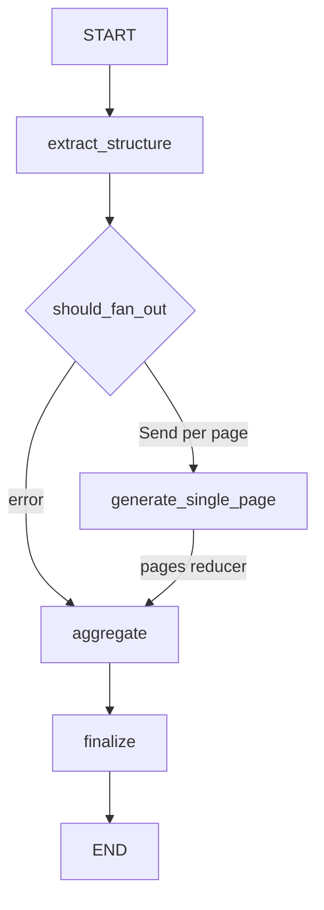

# Fan-out/Fan-in Refactoring for Wiki Page Generation

**Date**: 2025-01-08
**Status**: Proposed
**Author**: Claude (assisted)

## Problem Statement

The current `generate_pages_node` in `src/agents/wiki_workflow.py` uses a single agent instance that sequentially generates all pages in a `for` loop. This causes:

- **Context accumulation**: The agent's context grows with each page, leading to confusion
- **Lost focus**: With many pages, the agent loses track of what it needs to do
- **No isolation**: Each page generation shares state with previous pages

### Evidence from LangSmith Trace

Trace ID `019ba036-c1b0-7f81-b8a5-4e275fded781` shows the current execution pattern where a single `generate_pages` node handles all pages sequentially within a single execution context.

## Solution: LangGraph Send API for Fan-out/Fan-in

Use LangGraph's `Send` API to dynamically spawn independent worker executions for each page, then aggregate results.

### Architecture Overview

```
Current Flow:
extract_structure → generate_pages (loop inside) → aggregate → finalize

New Flow:
extract_structure → fan_out_pages → [generate_single_page × N] → aggregate → finalize
                         ↓                    ↓
                   Returns Send()      Each runs independently
                   for each page       with fresh agent instance
```

## Implementation Plan

### Step 1: Add New State for Single Page Generation

Create a `PageGenerationState` TypedDict for the worker node that receives just one page:

```python
# In wiki_workflow.py
from langgraph.types import Send

class PageGenerationState(TypedDict):
    """State for single page generation worker."""
    page: WikiPageDetail          # The page to generate
    clone_path: str               # Repository path
    structure_description: str    # Wiki description for context
    repository_id: str            # For middleware
```

**File**: `src/agents/wiki_workflow.py` (lines ~87-110)

### Step 2: Create Fan-out Function

Replace `generate_pages_node` with a splitter function that returns `Send` objects:

```python
def fan_out_to_page_workers(state: WikiWorkflowState) -> List[Send]:
    """Fan-out: create Send for each page to generate."""
    if state.get("error") or not state.get("structure"):
        return []  # Will be handled by conditional routing

    structure = state["structure"]
    all_pages = structure.get_all_pages()

    logger.info("Fanning out page generation", total_pages=len(all_pages))

    return [
        Send("generate_single_page", {
            "page": page,
            "clone_path": state["clone_path"],
            "structure_description": structure.description,
            "repository_id": state["repository_id"],
        })
        for page in all_pages
    ]
```

**File**: `src/agents/wiki_workflow.py` (new function, ~line 240)

### Step 3: Create Single Page Worker Node

Create a new node that generates content for exactly one page:

```python
async def generate_single_page_node(state: PageGenerationState) -> Dict[str, Any]:
    """Generate content for a single wiki page.

    Each invocation gets a fresh agent with clean context.
    Returns a single page to be aggregated via reducer.
    """
    page = state["page"]
    clone_path = state["clone_path"]
    repository_id = state["repository_id"]
    structure_description = state["structure_description"]

    logger.info("Generating single page", page_id=page.id, page_title=page.title)

    # Create FRESH agent for this page (no shared context)
    agent = await create_page_agent()

    # Build user message for this page
    file_list = "\n".join(f"- {clone_path}/{fp}" for fp in page.file_paths) if page.file_paths else "No specific files assigned"
    user_message = PROMPTS.get("page_generation_full", {}).get("user_prompt", "").format(
        page_title=page.title,
        page_description=page.description,
        importance=page.importance.value if hasattr(page.importance, 'value') else page.importance,
        seed_paths_list=file_list,
        clone_path=clone_path,
        repo_name=Path(clone_path).name if clone_path else "",
        repo_description=structure_description
    )

    try:
        result = await agent.ainvoke({
            "messages": [{"role": "user", "content": user_message}],
            "repository_id": repository_id,
        })
        content = result.get("generated_content", "")

        if not content:
            logger.warning("No content generated", page_id=page.id)

        page_with_content = page.model_copy(update={"content": content})

    except Exception as e:
        logger.error("Page generation failed", page_id=page.id, error=str(e))
        page_with_content = page.model_copy(update={
            "content": f"*Error generating content: {str(e)}*"
        })

    # Return single page - will be aggregated via operator.add reducer
    return {"pages": [page_with_content]}
```

**File**: `src/agents/wiki_workflow.py` (new function, ~line 260)

### Step 4: Add Error Routing Function

Handle the case where structure extraction failed:

```python
def should_fan_out(state: WikiWorkflowState) -> Union[List[Send], str]:
    """Decide whether to fan out or route to error handling."""
    if state.get("error"):
        return "aggregate"  # Skip to aggregate which handles errors
    if not state.get("structure"):
        return "aggregate"

    return fan_out_to_page_workers(state)
```

**File**: `src/agents/wiki_workflow.py` (new function, ~line 320)

### Step 5: Update Workflow Assembly

Modify `create_wiki_workflow()` to use conditional edges with Send:

```python
def create_wiki_workflow():
    """Create wiki workflow with fan-out/fan-in for page generation."""
    builder = StateGraph(WikiWorkflowState)

    # Add nodes
    builder.add_node("extract_structure", extract_structure_node)
    builder.add_node("generate_single_page", generate_single_page_node)  # Worker node
    builder.add_node("aggregate", aggregate_node)
    builder.add_node("finalize", finalize_node)

    # Edges
    builder.add_edge(START, "extract_structure")

    # Fan-out: conditional edge that returns Send objects
    builder.add_conditional_edges(
        "extract_structure",
        should_fan_out,
        ["generate_single_page", "aggregate"]  # Possible targets
    )

    # Fan-in: all workers converge to aggregate
    builder.add_edge("generate_single_page", "aggregate")

    builder.add_edge("aggregate", "finalize")
    builder.add_edge("finalize", END)

    return builder.compile()
```

**File**: `src/agents/wiki_workflow.py` (lines 453-480)

### Step 6: Clean Up Old Code

Remove or deprecate:
- The old `generate_pages_node` function (lines 239-338)
- Update any imports if needed

### Step 7: Add Concurrency Limit

Configure the workflow to limit concurrent page generation to 5 workers:

```python
# When invoking the workflow, use config to limit concurrency
async def run_wiki_workflow(state: WikiWorkflowState) -> WikiWorkflowState:
    """Run workflow with concurrency limit."""
    config = {"configurable": {"max_concurrency": 5}}
    return await wiki_workflow.ainvoke(state, config=config)
```

**File**: `src/agents/wiki_workflow.py` and `src/services/wiki_service.py` (where workflow is invoked)

## Files to Modify

| File | Changes |
|------|---------|
| `src/agents/wiki_workflow.py` | Main refactoring - new state, fan-out function, worker node, updated edges |
| `src/services/wiki_service.py` | Add concurrency config when invoking workflow |
| `tests/unit/test_wiki_workflow.py` | Update tests for new node structure |

## Key Benefits

1. **Fresh Context Per Page**: Each page gets its own agent instance with clean context
2. **Parallel Execution**: Up to 5 pages generate concurrently (configurable)
3. **Isolated Failures**: One page failing doesn't affect others
4. **Better Observability**: Each page is a separate trace node in LangSmith
5. **Simpler Agent Logic**: Agent only needs to handle one page, not track progress
6. **Resource Management**: Concurrency limit of 5 prevents overwhelming system resources

## State Flow Diagram



## Verification Plan

1. **Unit Tests**: Update `tests/unit/test_wiki_workflow.py` to test new nodes
2. **Integration Test**: Run wiki generation on a small repo (3-5 pages)
3. **LangSmith Trace**: Verify separate trace nodes for each page
4. **Large Repo Test**: Test with 10+ pages to confirm context isolation works

### Test Commands

```bash
# Run existing tests first to ensure no regressions
pytest tests/unit/test_wiki_workflow.py -v

# Integration test with a small repository
pytest tests/integration/test_wiki_data_flow.py -v

# Manual verification via API
curl -X POST http://localhost:8000/api/wiki/generate \
  -H "Content-Type: application/json" \
  -d '{"repository_url": "https://github.com/user/small-repo"}'
```

## Migration Notes

- The `pages` field already uses `Annotated[List[WikiPageDetail], operator.add]` reducer - no change needed
- The `aggregate_node` already handles merging pages into structure - no change needed
- `PageAgentWrapper` and `create_page_agent` remain unchanged

## Risk Assessment

| Risk | Mitigation |
|------|------------|
| Breaking existing tests | Run test suite before/after each change |
| Memory usage with many parallel agents | Concurrency limit of 5 prevents resource exhaustion |
| Error propagation | Existing error handling in aggregate_node handles this |

## References

- [LangGraph Send API Documentation](https://langchain-ai.github.io/langgraph/concepts/low_level/#send)
- [Map-Reduce Pattern with LangGraph](https://langchain-ai.github.io/langgraph/how-tos/graph-api/)
- LangSmith Trace: `019ba036-c1b0-7f81-b8a5-4e275fded781`
